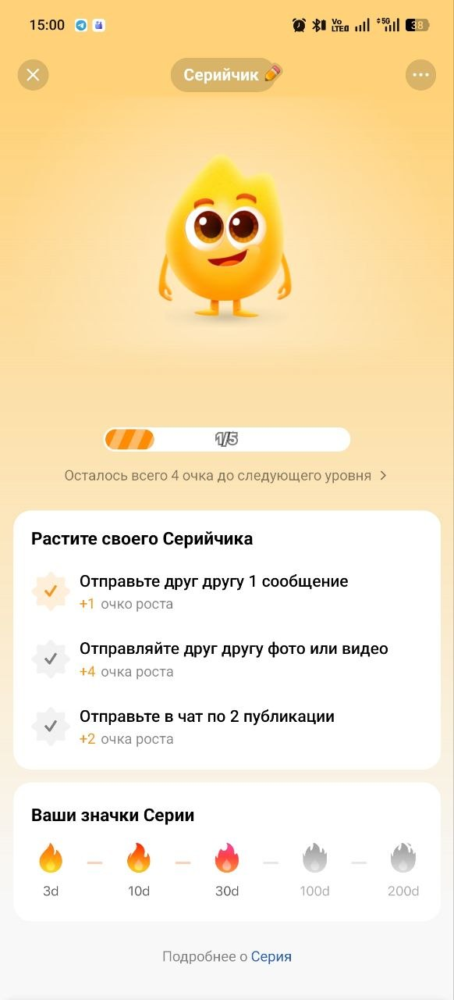
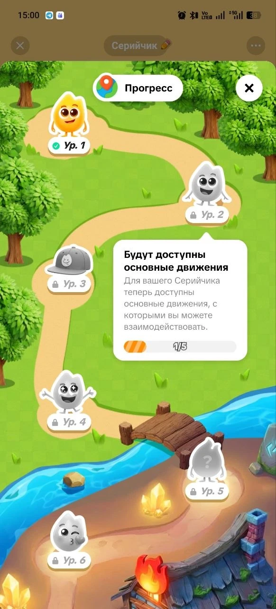
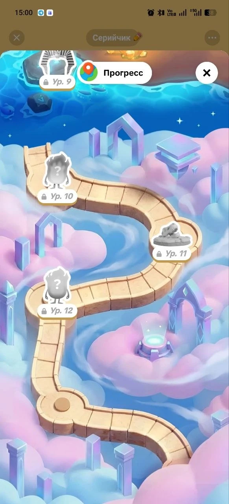

# LovePandas — дизайн-документ

> Статус: концепция. Документ фиксирует всё, что обсудили на этапе идеи.
> Раздел «Решения» — договорились. «Предложения» — стоит сделать, но не утверждено.
> «Открытые вопросы» — ещё думаем.

---

## 1. Концепция

**Приложение-таскер для пар в виде милой игры.**

У каждого партнёра на смартфоне свой мультяшный персонаж (красная панда, енотик, котёнок и т.д.).
Партнёры ставят друг другу задания на доске объявлений и платят за них игровыми монетами.
Выполняешь задания партнёра — зарабатываешь. Ставишь задания партнёру — тратишь.
На заработанное наряжаешь своего персонажа, как тамагочи.

**Ядро в одну строку:**
выполняешь задания → получаешь монеты → ставишь задания / покупаешь одежду → тратишь монеты.

**Ориентиры:** Habitica (геймификация дел), тамагочи (питомец-альтер эго),
доска заказов из «Ведьмака» (задания на доске).

**Платформа:** Android. **Движок:** Unity.

**Главный принцип:** приложение должно быть **супер простым**.

---

## 2. Решения (договорились)

### 2.1. Первый запуск
1. Регистрация / вход.
2. Связка с партнёром (код-приглашение или ссылка). Одна пара — два игрока.
3. Выбор персонажа из списка мультяшных зверьков.

### 2.2. Основной цикл
1. Выбираешь персонажа — он появляется на весь экран в «вайбовой» локации.
2. Видишь свои монеты, можешь разместить первое задание.
3. Размещаешь задание — второй игрок выполняет его, ты тратишь свои монеты.
4. Подходишь к доске, берёшь задание партнёра, выполняешь — получаешь монеты.
5. Одеваешь персонажа за монеты.

### 2.3. Задания
- Задания пишут **сами игроки, вручную**, что хотят и как хотят.
- **Цену назначает автор сам.** Живая экономика: если исполнитель считает оплату
  слишком маленькой — он просто не берёт задание.

### 2.4. Экономика
- Стартовый запас монет у каждого игрока.
- **Пассивный ежедневный доход** — монеты капают каждый день.
- Заработок на заданиях партнёра — основной доход.
- Траты: оплата своих заданий + магазин кастомизации.

### 2.5. Кастомизация
- Магазин предметов: шляпки, шортики, перчатки и т.п.
- Купленные предметы надеваются на персонажа в гардеробе.

---

## 3. Первая версия (MVP) — 4 экрана

| # | Экран | Что есть |
|---|-------|----------|
| 1 | **Персонаж** (главный) | Персонаж на весь экран в локации, баланс монет сверху, кнопки «Доска» и «Магазин» |
| 2 | **Доска заданий** | Два списка: «мои задания» и «задания партнёра». Кнопка «+» → форма: текст + цена |
| 3 | **Магазин** | Сетка предметов, покупка в один тап |
| 4 | **Гардероб** | Надеть / снять купленные вещи |

Плюс одноразово: вход → связка с партнёром по коду → выбор персонажа.

**Экономика MVP:** стартовые монеты + ежедневный бонус за вход + задания друг другу. Больше ничего.

---

## 4. Жизненный цикл задания (предложение)

```
Создано ──► Взято ──► Выполнено ──► Подтверждено ──► Выплата исполнителю
  │                      │
  │ (отмена автором,     │ (автор отклонил / истёк срок)
  │  пока не взято)      ▼
  └────────────────► Монеты возвращаются автору
```

- **Эскроу:** при создании задания монеты сразу списываются с автора и «замораживаются».
  Нельзя пообещать больше, чем у тебя есть.
- Исполнитель отмечает «выполнено», **автор подтверждает** — монеты уходят исполнителю.
- Автоподтверждение через 24–48 ч, чтобы задание не висело вечно.
- Пока задание никто не взял — автор может его отменить и вернуть монеты.
- После подтверждения — анимация благодарности персонажа (эмоциональный момент).

**Поля задания:** текст (название/описание), цена. Позже: срок, категория/иконка, повторяемость.

---

## 5. Потом (после MVP)

### 5.1. Живой рынок: торг
- **Встречная цена:** исполнитель предлагает свою цену («за 20 не пойду, давай 50»),
  автор соглашается или нет.
- **Поднять награду:** если задание долго не берут, автор может доложить монет.

### 5.2. Личные задачи в стиле Habitica
Игрок зарабатывает монеты на своих личных делах (привычки, ежедневные дела, разовые to-do).

Защита от накрутки (монеты даёт система, а не партнёр):
- Награда **фиксированная** по сложности: лёгкая 3 / средняя 5 / трудная 10.
- **Дневной лимит** на заработок с личных задач (например, 30 монет).
- Главный заработок всё равно должен идти с заданий партнёра.

### 5.3. «Привычки на виду» (понравилось 👍)
Партнёр видит твои привычки — это одновременно мягкий контроль и забота.

Что видит партнёр:
- список привычек и дел, отмечено ли сегодня;
- стрики («🔥 12 дней без сладкого»);
- ленту событий («Панда выполнила: пробежка 3 км»).

Что может сделать партнёр:
- **реакции** ❤️ 👏 💪 🔥 — персонаж-автор радуется;
- **поддержать монеткой** — подкинуть 1–5 монет из своего кошелька (платит человек, не система — не накрутка);
- **короткий комментарий** («Горжусь тобой!»);
- **напоминание** — мягкое, лимит 1 раз в день на привычку.

Границы:
- галочка **«скрыть от партнёра»** для личных привычек;
- **никаких «провалов» напоказ** — невыполненное просто не отмечено, без красных крестиков и уведомлений партнёру.

### 5.4. Серия пары (как «огонёк»/серийчик в TikTok)
Пока у пары идёт серия дней, персонажи **визуально улучшаются**: появляются эффекты,
скин «прокачивается». Это визуальная награда за то, что у пары всё хорошо.

#### Как устроено в TikTok (референс)
- **Огонёк** — серия дней, когда **оба** собеседника написали друг другу хотя бы одно сообщение.
- **Серийчик (Streak Pet)** — общий виртуальный питомец двоих, «тамагочи в чате».
  Один приглашает, второй принимает.
- Сначала питомец — **яйцо**. Переписывались 3 дня подряд — яйцо вылупляется.
- Каждый день серии даёт **очки роста**, плюс небольшие ежедневные задания для роста быстрее.
- По очкам питомец **эволюционирует** через стадии: меняет форму, получает анимации,
  становится «выразительнее». Можно заранее посмотреть будущие формы и сколько очков до них нужно.
- Пока сегодня никто не написал — питомец **«заморожен»**; оба написали — «размораживается».
  Это визуальное напоминание поддержать серию.
- Питомца можно **наряжать** (одежда, шапки, аксессуары), он получает **бейджи серии**.
- Серия прервалась — питомец перестаёт расти. Восстановить можно, если быстро
  возобновить переписку (≈ в течение 48 ч), но **очки роста сбрасываются**.
- Если любой из двоих удаляет серийчика — он пропадает у обоих.

#### Разбор по скриншотам (docs/references/tiktok-streak/)




**Две независимые оси прогресса** — главное открытие:
1. **Дни серии** (на скрине: 38) → **значки серии** 🔥 3д / 10д / 30д / 100д / 200д (огонёк меняет цвет).
2. **Очки роста** → **уровни питомца** (на скрине: ур. 1, 1/5 очков — при 38 днях серии!).
   Дни дают статус, очки дают развитие; уровни растут только за активность, а не за само время.

**Главный экран:** счётчик дней серии, аватарки обоих, питомец крупно по центру,
полоска прогресса уровня («Осталось всего 4 очка до следующего уровня»),
блок «Растите своего Серийчика» — ежедневные задания с галочками:
- Отправьте друг другу 1 сообщение — **+1** очко роста
- Отправляйте друг другу фото или видео — **+4**
- Отправьте в чат по 2 публикации — **+2**

Задания **взаимные** («друг другу», «по 2») — засчитываются, только когда сделали оба.
Очень лёгкое → +1, чуть сложнее → больше очков.

**Карта прогресса:** дорожка через тематические зоны (лес → река с мостиком → облака/небеса,
с пирамидами/фараоном дальше). На дорожке уровни, каждый что-то открывает:
- ур. 2 — «Будут доступны основные движения» (с питомцем можно взаимодействовать);
- ур. 3 — аксессуар (кепка);
- ур. 4, 6 — новые эмоции/позы (радость, воздушный поцелуй);
- ур. 5, 10, 12 — «?» — сюрприз, скрыто до открытия;
- ур. 9 — тематический наряд (головной убор фараона), ур. 11 — объект (череп динозавра).
Открытое — цветное, закрытое — серый силуэт с замком. Тап по уровню → подсказка, что откроется, и прогресс.

#### Перенос на LovePandas (предложение)
Та же схема с двумя осями:

**Ось 1 — дни серии пары** → значки 3 / 10 / 30 / 100 / 200 дней и эффекты на персонажах (вариант А).

**Ось 2 — очки роста** → уровни → карта прогресса. Ежедневные взаимные задания, например:

| Ежедневное задание пары | Очки |
|---|---|
| Оба зашли в приложение | +1 |
| Оба поставили друг другу задание | +2 |
| Оба выполнили задание партнёра | +4 |
| Оба отреагировали на привычку/задание партнёра | +1 |

(Не путать с заданиями на доске: это системные мини-цели дня, как в TikTok.)

**Что открывают уровни:** новые анимации и эмоции персонажей (обнимашки, воздушный поцелуй,
танец вдвоём), эксклюзивные предметы (нельзя купить за монеты), **новые локации** —
зоны карты прогресса и есть локации игры (лес → река → облака…), уровни-сюрпризы «?».
Если выбран вариант Б — те же уровни растят общего питомца.

#### Вариант Б: общий питомец пары (как в TikTok)
Кроме своих персонажей у пары есть **общий питомец** (например, малыш-панда):
- появляется яйцом после связки пары, вылупляется после 3 дней серии;
- растёт от очков роста за взаимные действия (задания друг другу, подтверждения, реакции);
- эволюционирует по стадиям, можно заранее видеть будущие формы;
- «замерзает», если сегодня пара ещё ничего не сделала друг для друга;
- живёт в локации рядом с персонажами обоих.

Варианты А (эффекты на персонажах, ниже) и Б можно совместить. **Решение пока не принято.**

#### Вариант А: эффекты на персонажах

**Что считается днём серии** (предложение): не «не было ссоры», а **взаимодействие обоих за день**,
как в TikTok, где серия — это обмен сообщениями обоих:
- оба зашли в приложение **и** каждый сделал что-то для другого
  (поставил или выполнил задание, подтвердил выполнение, отреагировал на привычку партнёра).

Так серию нельзя «натыкать» ложной кнопкой «всё хорошо» — её нужно реально поддерживать
заботой друг о друге (см. проблему стимула врать в 6.1).

**Этапы серии (пример):**

| Дней | Эффект |
|---|---|
| 3 | Огонёк / счётчик серии рядом с персонажами |
| 7 | Искорки вокруг персонажей |
| 14 | Летающие сердечки |
| 30 | Сияющая аура, скин «прокачивается» (цвет, узор) |
| 100 | Особый эффект: крылья / корона / нимб; бейдж пары |
| 365 | Легендарный скин пары |

**Правила:**
- Эффекты **общие для пары** — видны на обоих персонажах одинаково.
- Эффекты нельзя купить за монеты — только заработать серией.
- **Потеря серии:** огонёк гаснет, эффекты пропадают.
- **Восстановление:** в течение 48 ч после обрыва, не чаще 1 раза в месяц,
  чтобы один пропущенный день не обнулял месяцы.
- Высшие достигнутые этапы остаются в профиле как **достижения** («Была серия 100 дней»),
  даже если серия прервалась.
- Предупреждение, если серия под угрозой: «Огонёк гаснет! Сделайте что-то друг для друга сегодня 🔥».

**Открыто:** должна ли ссора (из механики настроения) влиять на серию — зависит от решения в 6.1.
Если да, возвращается стимул врать, поэтому предлагается не связывать их напрямую.

### 5.5. Прочее
- Смена локаций (покупка новых локаций в магазине).
- Общий дом: оба персонажа живут в одной локации, видно наряд партнёра.
- Push-уведомления: «Панда оставила тебе задание 🐼», «Задание выполнено», «Подтверди выполнение».
- Архив выполненных заданий и статистика пары («вы выполнили 100 заданий друг для друга»).
- Типы заданий: бытовые, романтические, «желания», задание-сюрприз, совместные квесты (платит система).
- Настроение персонажа как у тамагочи — но **без наказаний** (персонаж не умирает и не грустит от бездействия).

---

## 6. Открытые вопросы

### 6.1. Механика настроения — ⚠️ думаем, вернёмся позже

**Исходная идея:** оба партнёра заходят и жмут настроение. Если оба «хорошее» — обоим немного монет.
Если хотя бы один жмёт негатив (ссора) — не получает никто. Стимул не ссориться и мириться.

**Найденные проблемы:**
- **Стимул врать.** Пока деньги зависят от выбранного смайлика, выгодно жать «хорошо».
  При любой серии/стрике люди будут жать «хорошо», чтобы её не потерять,
  даже если в отношениях всё очень плохо. Кнопка перестаёт что-либо измерять.
- **Смайлик как оружие.** «Опять из-за тебя без денег» — механика сама может стать поводом для ссоры.
- **Бонус за примирение деньгами** создаёт стимул изображать ссоры ради бонуса.

**Рассмотренный вариант (не утверждён):**
- Платить за **сам факт отметки**, а не за её содержание — честный ответ ничего не стоит.
- Стрик = «дней подряд вы оба делились настроением», ссора его не рвёт.
- **Скрытое голосование:** ответы открываются одновременно, подстроиться нельзя.
- Несколько вариантов: 😊 хорошо / 😴 устал(а) / 😢 грустно / 😠 поссорились.
  На «грустно» партнёру подсказка: «Партнёру сегодня грустно — может, поддержишь?»
- Мотивация мириться — **эмоциональная, не денежная:** пока ссора, в локации пасмурно,
  персонажи дуются в разных углах; «помирились» → тучи расходятся, персонажи обнимаются;
  запись в общий дневник пары.
- Если негатив много дней подряд — игровые механики уходят на второй план,
  приложение мягко предлагает материалы / семейного психолога.
- Личный дневник настроения, который партнёр не видит.

### 6.2. Прочие вопросы
- 2D или 3D? (предложение: **2D** — проще арт и кастомизация)
- Бэкенд? (предложение: **Firebase** — см. раздел 8)
- Кто делает арт: художник, покупные ассеты, генерация?
- Проверка выполнения: только подтверждение автора или ещё фото?
- Что происходит при «разрыве» пары: удаление данных или архив?
- Сколько персонажей и предметов в MVP?

---

## 7. Баланс — стартовые ориентиры (подбирать на тестах)

| Источник | Монет |
|---|---|
| Стартовый запас | 100 (?) |
| Ежедневный вход | 10 / день |
| Задания партнёра | без ограничений, цену ставит автор |
| *Потом:* личные задачи | до 30 / день (лимит) |

| Магазин | Цена |
|---|---|
| Мелочи | 50–100 |
| Заметные вещи | 200–400 |
| Редкие наряды | 1000+ |

Идея: одна шляпка ≈ 2–3 дня активности, редкая вещь — только через обмен заданиями с партнёром.

**Риски экономики, которые держим в голове:**
- Монеты между партнёрами только переходят, а магазин их сжигает → без притока от системы
  деньги со временем закончатся. Поэтому нужен ежедневный доход.
- Перекос: кто чаще ставит задания — беднеет. Следить на тестах.
- Системный доход не должен быть больше заработка на заданиях партнёра,
  иначе задания друг другу теряют смысл.

---

## 8. Техника (предложения)

### 8.1. Стек
- **Unity**, платформа **Android**.
- **2D**, UI — uGUI или UI Toolkit. Приложение на ~70% состоит из UI (доска, формы, магазин).
- **Бэкенд: Firebase** (быстрый старт):
  - Authentication — вход;
  - Firestore — пары, игроки, задания, инвентарь;
  - Cloud Functions — все операции с монетами (эскроу, выплаты, ежедневный бонус),
    **только на сервере**, иначе балансы у партнёров разъедутся;
  - Cloud Messaging (FCM) — push-уведомления.
  - Альтернативы: Supabase, Nakama.

### 8.2. Кастомизация персонажей
Проблема: N персонажей × M предметов = очень много спрайтов.
Решение: **единый «скелет» и точки крепления** (голова, торс, лапы) у всех зверьков,
чтобы одна шляпа подходила всем с небольшими оффсетами.
Инструменты: Unity 2D Animation (Sprite Library / Sprite Resolver) или Spine.

### 8.3. Модели данных (черновик)
```
Couple   { id, playerIds[2], inviteCode, createdAt }
Player   { id, coupleId, name, characterId, coins, equippedItems{slot: itemId}, lastDailyBonusAt }
Quest    { id, coupleId, authorId, assigneeId?, text, reward,
           status: Created|Taken|Done|Confirmed|Rejected|Cancelled|Expired,
           createdAt, takenAt?, doneAt?, confirmedAt? }
Item     { id, name, slot: Head|Body|Legs|Hands|..., price, sprite }
Inventory{ playerId, itemIds[] }
```

---

## 9. Монетизация (если понадобится)
- **Не продавать монеты за реальные деньги** — иначе монеты перестанут означать заботу
  и труд партнёра, смысл пропадёт.
- Продавать: наборы одежды, новых персонажей, локации, подписку.
